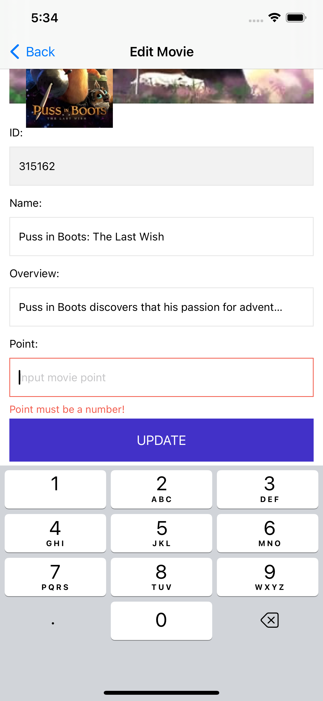

# Model View Presenter - Router (MVP-R) iOS App

Liked some of my work? Buy me a coffee (or more likely a beer)

## Features :heart:
- Architecture: <a href="https://viblo.asia/p/model-view-presenter-router-mvp-r-trong-ios-GAWVpdm5V05">Model View Presenter - Router (MVP-R)</a>
- API: <a href="https://developers.themoviedb.org/3/getting-started/introduction">TMDB-Movies APIs</a>
- Dependency Injection

## Structure Application

## Application
| Upcoming Movies | Edit Movie  | Update Movie  |  Submit Changes  |
| ------------ | ------------ | ------------ | ------------ |
|  |  |  |  |

## Model View Presenter - Router (MVP-R) :heart:

  

* `View` - delegates user interaction events to the `Presenter` and displays data passed by the `Presenter`
    * All `UIViewController`, `UIView`, `UITableViewCell` subclasses belong to the `View` layer
* `Presenter` - contains the presentation logic and tells the `View` what to present
    * Usually we have one `Presenter` per scene (view controller)
    * It doesn't reference the concrete type of the `View`, but rather it references the `View` protocol that is implemented usually by a `UIViewController` subclass
    * It should be a plain `Swift` class and not reference any `iOS` framework classes - this makes it easier to reuse it maybe in a `macOS` application
    * It should be covered by Unit Tests
* `Router` - contains navigation / flow logic from one scene (view controller) to another
    * In some communities / blog posts it might be referred to as a `FlowController`
    * It is usually referenced by the `Presenter` and weak referenced by the `View` (UIViewController)
    
## Requirements

- iOS 12.0+
- Xcode 11+

## Installation

- To install the app, clone the repository and open the `TMDB-Movies-MVP.xcworkspace` file in Xcode.

## Usage

- My vietnamese blog: <a href="https://viblo.asia/p/model-view-presenter-router-mvp-r-trong-ios-GAWVpdm5V05">MVP-R blog</a>

## Contribution

<a href="https://www.linkedin.com/in/kien-ht/">Hoàng Trọng Kiên (Bradley)</a>

## Reference

- https://github.com/FortechRomania/ios-mvp-clean-architecture
